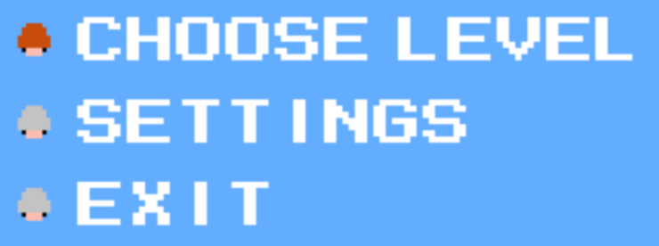
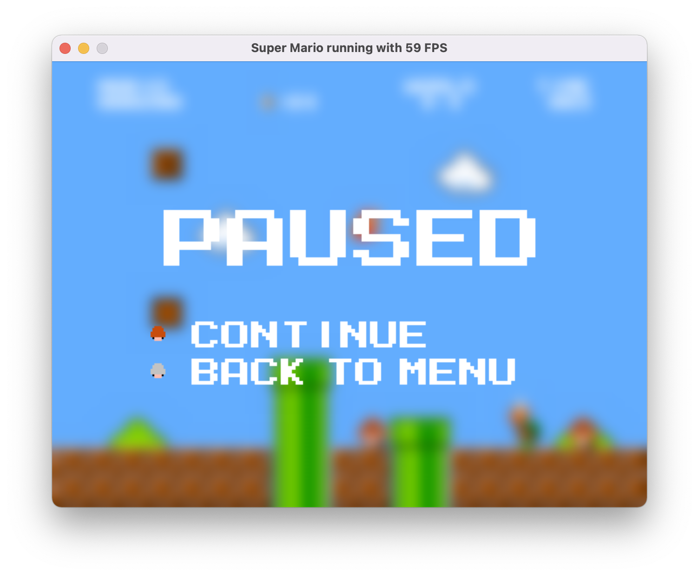

# 기존 코드 문서

기존에 작성되있던 클래스, 함수를 문서화 하여 향후 개발에 참고할 예정이다.

## 목차

1. [classes](#classes)
   1. [classes.Menu.Menu](#classesmenumenu)
   2. [classes.Dashboard.Dashboard](#classesdashboarddashboard)
   2. [classes.Level.Level](#classeslevellevel)
   2. [classes.Sound.Sound](#classessoundsound)
   2. [classes.Pause.Pause](#classespausepause)
   2. [classes.Sprite.Sprite](#classesspritesprite)

# classes

프로그램의 구동과 관련된 클래스들로 구성되어 있다.

## classes.Menu.Menu

```py
class Menu(screen=None,
	dashboard=None,
	level=None,
	sound=None)
```

### 목적

게임 시작 직후 나오는 메인 화면과 설정 화면을 담당하는 클래스.


### 파라미터

#### screen

* 타입: pygame.Surface

* 설명: 메인 화면을 그릴 공간.

#### dashboard

* 타입: [classes.Dashboard.Dashboard](#classesdashboarddashboard)

* 설명: 화면에 게임 플레이와 관련된 글자를 그리는 클래스. 여기서는 **선택 메뉴의 글자 출력**을 위해서 쓰임.

#### level

* 타입: [classes.Level.Level](#classeslevellevel)

* 설명: 레벨 배경 출력, 레벨 목록 생성 등 레벨에 관한 전반적인 입출력을 담당하는 클래스. 여기서는** 메인화면 뒷 배경 출력, 레벨 목록 생성 및 선택, 메뉴에서의 키보드 입력 감지** 를 위해 사용됨.

#### sound

* 타입: [classes.Sound.Sound](#classessoundsound)

* 설명: 게임 소리 출력을 담당하는 클래스. 여기서는 **배경음 재생 및 사운드 설정**을 위해서 사용됨.

### 메소드

#### update

* 설명: 메인 화면을 업데이트 하기 위한 함수.
* 파라미터: 없음
* 리턴값: 없음
* 예외: 없음

#### drawDot

* 설명: 메인화면에서 선택 항목 중 어떤걸 선택했는지 텍스트 왼쪽에 점으로 보여주는 함수.

* 파라미터: 없음

* 리턴값: 없음

* 예외: 없음

  

#### loadSettings

* 설명: 환경설정 데이터를 가져오는 함수. 환경설정 화면 선택시 사용.
* 파라미터
  * url : str - 환경설정 저장 경로
* 리턴값: 없음
* 예외
  * IOError, OSError - 환경설정 정보가 저장된 json 파일이 없을때 예외 발생. 모든 설정값을 False로 설정한 다음 json 파일을 생성한다.

#### saveSettings

* 설명: 변경된 환경설정 데이터를 저장하는 함수
* 파라미터
  * url : str - 환경설정 저장 경로
* 리턴값: 없음
* 예외: 없음

#### drawMenu

* 설명: 메인 화면에서 선택지를 보여주는 함수.
* 파라미터: 없음
* 리턴값: 없음
* 예외: 없음

#### drawMenuBackground

* 설명: 메인 화면에서 배경을 그리는 함수.
* 파라미터
  * withBanner=True : bool - Super Mario Bros 배너를 보여주는지 여부. 현재는 레벨 선택 화면에서 배너를 안보이기 하기 위해 사용중.
* 리턴값: 없음
* 예외: 없음

#### drawSettings

* 설명: 메인 화면에서 **환경설정**을 선택할 시 환경설정 화면을 그리는 함수.
* 파라미터: 없음
* 리턴값: 없음
* 예외: 없음

#### chooseLevel

* 설명: 메인 화면에서 **레벨 고르기**를 선택할 시 레벨 선택 화면을 구성하는 함수.
* 파라미터: 없음
* 리턴값: 없음
* 예외: 없음

#### drawBorder

* 설명: 레벨 선택 화면에서 레벨 선택 박스경계선을 그리는 함수.
* 파라미터
  * x : int - 그리기 시작할 x 좌표
  * y : in - 그리기 시작할 y 좌표
  * width : int - 경계선의 너비
  * height : int - 경계선의 높이
  * color : tuple[int] - 경계선의 색
  * thockness : int - 경계선의 두께
* 리턴값: 없음
* 예외: 없음

#### drawLevelChooser

* 설명: 선택된 레벨만 다른 색으로 표현하는 함수.
* 파라미터: 없음
* 리턴값: 없음
* 예외: 없음

#### loadLevelNames

* 설명: ./levels/ 폴더 안에 있는 레벨들의 파일 이름을 가져와 리턴하는 함수.
* 파라미터: 없음
* 리턴값 : list[str] - 레벨 이름들을 리스트 형태로 리턴.
* 예외: 없음

#### checkInput

* 설명: 메인 화면에서 키 입력에 관여하는 함수.
* 파라미터: 없음
* 리턴값: 없음
* 예외: 없음

## classes.Dashboard.Dashboard

```py
class Dashboard(filePath=None,
	size=None,
	screen=None)
```

### 목적

화면에 텍스트 출력을 담당하는 클래스. [classes.Font.Font](classesfontfont)의 하위 클래스이다.

### 파라미터

#### filePath

* 타입: str

* 설명: 폰트 파일 경로

#### size

* 타입: int
* 설명: 텍스트의 사이즈. 현재는 쓰이지 않음.

#### screen

* 타입: pygame.Surface
* 설명: 텍스트를 출력할 공간.

### 메소드

#### update

* 설명: 게임 플레이 상태를 반영해 텍스트를 업데이트하는 함수
* 파라미터: 없음
* 리턴값: 없음
* 예외: 없음

#### drawText

* 설명: 화면에 글자를 그리는 함수
* 파라미터
  * text : str - 출력할 텍스트
  * x : int - 출력할 x 좌표
  * y : int - 출력할 y 좌표
  * size : int - 출력할 텍스트 크기
* 리턴값: 없음
* 예외: 없음

#### coinString

* 설명: 코인 출력 포멧을 리턴하는 함수
* 파라미터: 없음
* 리턴값 : str - 코인 출력 포멧
* 예외: 없음

#### pointString

* 설명: 점수 출력 포멧을 리턴하는 함수
* 파라미터: 없음
* 리턴값 : str - 점수 출력 포멧
* 예외: 없음

#### timeString

* 설명: 플레이 시간 출력 포멧을 리턴하는 함수
* 파라미터: 없음
* 리턴값 : str - 플레이 시간 출력 포멧
* 예외: 없음

## classes.Level.Level

```py
class Level(screen=None,
	sound=None,
	dashboard=None)
```

### 목적

레벨 파일에서 가져온 데이터로 플레이 할 스테이지를 화면에 출력하는 클래스.

### 파라미터

#### screen

* 타입: pygame.Surface

* 설명: 스테이지를 그릴 공간

#### sound

* 타입: [classes.Sound.Sound](#classessoundsound)

* 설명: 레벨에 있는 구성요소마다 알맞는 효과음을 지정하기 위해 사용.

#### dashboard

* 타입: [classes.Dashboard.Dashboard](#classesdashboarddashboard)
* 설명: 레벨 구성 요소 중 점수와 관련된 요소에게 점수 표시 텍스트를 바꿀 수 있는 기능을 구현하기 위해 사용.

### 메소드

#### loadLevel

* 설명: 레벨 json 파일을 읽어와 구성요소를 파싱하는 함수
* 파라미터
  * levelname : str - 로딩할 레벨 파일 이름
* 리턴값 : 없음
* 예외: 없음

#### loadEntities

* 설명: 맵 json 데이터에서 엔티티(CoinBox, Goomba, Koopa, Coin, coinBrick, RandomBox) 추출하는 함수
* 파라미터
  * data : dict - 파싱할 맵 json 데이터
* 리턴값: 없음
* 예외
  * Exception - 엔티티가 레벨 데이터 안에 없을때 발생

#### loadLayers

* 설명: json 데이터에서 레이어(sky, ground) 추출하는 함수
* 파라미터
  * data : dict - 파싱할 맵 json 데이터
* 리턴값: 없음
* 예외: 없음

#### loadObjects

* 설명: 맵 json 데이터에서 오브젝트(bush, cloud, pipe, sky, ground) 추출하는 함수
* 파라미터
  * data : dict - 파싱할 맵 json 데이터
* 리턴값: 없음
* 예외: 없음

#### updateEntities

* 설명: 엔티티 목록을 업데이트 하는 함수
* 파라미터
  * cam : [classes.Camer.Camera](#classescameracamera) - 엔티티의 카메라. 엔티티의 모습을 바꿀때 사용
* 리턴값: 없음
* 예외: 없음

#### drawLevel

* 설명: 배경을 카메라에 따라 업데이트 하는 함수
* 파라미터
  * camera : [classes.Camer.Camera](#classescameracamera) - 화면을 보여주는 카메라.
* 리턴값: 없음
* 예외: IndexError - 맵 데이터인 리스트 level츼 인덱스 범위를 넘길때 발생

#### addCloudSprite

* 설명: 맵 데이터에 구름 스프라이트를 알맞은 위치에 추가하는 함수
* 파라미터
  * x : int - 구름 스프라이트를 추가할 x 좌표
  * y : int - 구름 스프라이트를 추가할 y 좌표
* 리턴값: 없음
* 예외: IndexError - 맵 데이터인 리스트 level츼 인덱스 범위를 넘길때 발생

#### addPipeSprite

* 설명: 맵 데이터에 파이프 스프라이트를 알맞은 위치에 추가하는 함수
* 파라미터
  * x : int - 파이프 스프라이트를 추가할 x 좌표
  * y : int - 파이프 스프라이트를 추가할 y 좌표
  * length : int - 정확한 용도 파악이 안됨
* 리턴값: 없음
* 예외: IndexError - 맵 데이터인 리스트 level츼 인덱스 범위를 넘길때 발생

#### addBushSprite

* 설명: 맵 데이터에 부쉬 스프라이트를 알맞은 위치에 추가하는 함수
* 파라미터
  * x : int - 부쉬 스프라이트를 추가할 x 좌표
  * y : int - 부쉬 스프라이트를 추가할 y 좌표
* 리턴값: 없음
* 예외: IndexError - 맵 데이터인 리스트 level츼 인덱스 범위를 넘길때 발생

#### addCoinBox

* 설명: 맵 데이터와 엔티티 리스트에 코인박스 스프라이트를 알맞은 위치에 추가하는 함수
* 파라미터
  * x : int - 코인박스 스프라이트를 추가할 x 좌표
  * y : int - 코인박스 스프라이트를 추가할 y 좌표
* 리턴값: 없음
* 예외: 없음

#### addRandomBox

* 설명: 맵 데이터와 엔티티 리스트에 랜덤박스 스프라이트를 알맞은 위치에 추가하는 함수
* 파라미터
  * x : int - 랜덤박스 스프라이트를 추가할 x 좌표
  * y : int - 랜덤박스 스프라이트를 추가할 y 좌표
  * item : str - 랜덤박스에서 나올 아이템을 지정하는 변수
* 리턴값: 없음
* 예외: 없음

#### addCoin

* 설명: 맵 데이터에 코인 스프라이트를 알맞은 위치에 추가하는 함수
* 파라미터
  * x : int - 코인 스프라이트를 추가할 x 좌표
  * y : int - 코인 스프라이트를 추가할 y 좌표
* 리턴값: 없음
* 예외: 없음

#### addCoinBrick

* 설명: 맵 데이터에 코인벽돌 스프라이트를 알맞은 위치에 추가하는 함수
* 파라미터
  * x : int - 코인벽돌 스프라이트를 추가할 x 좌표
  * y : int - 코인벽돌 스프라이트를 추가할 y 좌표
* 리턴값: 없음
* 예외: 없음

#### addGoomba

* 설명: 맵 데이터에 굼바 스프라이트를 알맞은 위치에 추가하는 함수
* 파라미터
  * x : int - 굼바 스프라이트를 추가할 x 좌표
  * y : int - 굼바 스프라이트를 추가할 y 좌표
* 리턴값: 없음
* 예외: 없음

#### addKoopa

* 설명: 맵 데이터에 쿠파 스프라이트를 알맞은 위치에 추가하는 함수
* 파라미터
  * x : int - 쿠파 스프라이트를 추가할 x 좌표
  * y : int - 쿠파 스프라이트를 추가할 y 좌표
* 리턴값: 없음
* 예외: 없음

#### addRedMushroom

* 설명: 맵 데이터에 빨간 버섯 스프라이트를 알맞은 위치에 추가하는 함수
* 파라미터
  * x : int - 빨간 버섯 스프라이트를 추가할 x 좌표
  * y : int - 빨간 버섯 스프라이트를 추가할 y 좌표
* 리턴값: 없음
* 예외: 없음

## classes.Sound.Sound

```py
class Sound()
```

### 목적

효과음과 배경음 재생에 관여하는 클래스

### 파라미터

없음

### 메소드

#### play_sfx

* 설명: 효과음을 재생하는 함수
* 파라미터
  * sfx : str - 재생할 효과음 이름
* 리턴값: 없음
* 예외: 없음

#### play_music

* 설명: 배경음악을 재생하는 함수
* 파라미터
  * music : str - 재생할 배경음악 이름
* 리턴값: 없음
* 예외: 없음

## classes.Pause.Pause

```py
class Pause(screen=None,
	entity=None,
	dashboard=None)
```

### 목적

게임 플레이를 일시정지 했을때 보이는 화면에 관여하는 클래스



### 파라미터

#### screen

* 타입: pygame.Surface
* 설명: 정지화면을 그릴 공간

#### entity

* 타입: [entities.Mario.Mario](#entitiesmariomario)
* 설명: 정지 여부를 판단할 마리오 캐릭터

#### dashboard

* 타입: [classes.Dashboard.Dashboard](#classesdashboarddashboard)
* 설명: 정지 화면에서 텍스트 출력을 위한 클래스

### 메소드

#### update

* 설명: 일시정지 화면을 업데이트 하기 위한 함수.
* 파라미터: 없음
* 리턴값: 없음
* 예외: 없음

#### drawDot

* 설명: 일시정지 화면에서 선택 항목 중 어떤걸 선택했는지 텍스트 왼쪽에 점으로 보여주는 함수.
* 파라미터: 없음
* 리턴값: 없음
* 예외: 없음

#### checkInput

* 설명: 일시정지 화면에서 키 입력에 관여하는 함수.
* 파라미터: 없음
* 리턴값: 없음
* 예외: 없음

#### createBackgroundBlur

* 설명: 일시정지 화면에서 뒷 배경에 블러 효과를 주는 함수
* 파라미터: 없음
* 리턴값: 없음
* 예외: 없음

## classes.Sprite.Sprite

### 목적

스프라이트를 그리는 클래스

### 파라미터

#### image

* 타입: pygame.Surface
* 설명: 그릴 대상이 되는 스프라이트

#### colliding

* 타입: bool
* 설명: 충돌 판정 여부

#### animation

* 타입: [classes.Animation.Animation](#classesanimationanimation)
* 설명: 엔티티의 상태에 따른 이미지를 바꿔주기 위한 클래스

#### redrawBackground

* 타입: bool
* 설명: 해당 스프라이트를 그릴때 배경을 다시 그릴지 여부

### 메소드

#### drawSprite

* 설명: 스프라이트를 그리는 함수
* 파라미터
  * x : int - 스프라이트를 그릴 x 좌표
  * y : int - 스프라이트를 그릴 y 좌표
  * screen : pygame.Surface - 스프라이트를 그릴 공간
* 리턴값: 없음
* 예외: 없음
