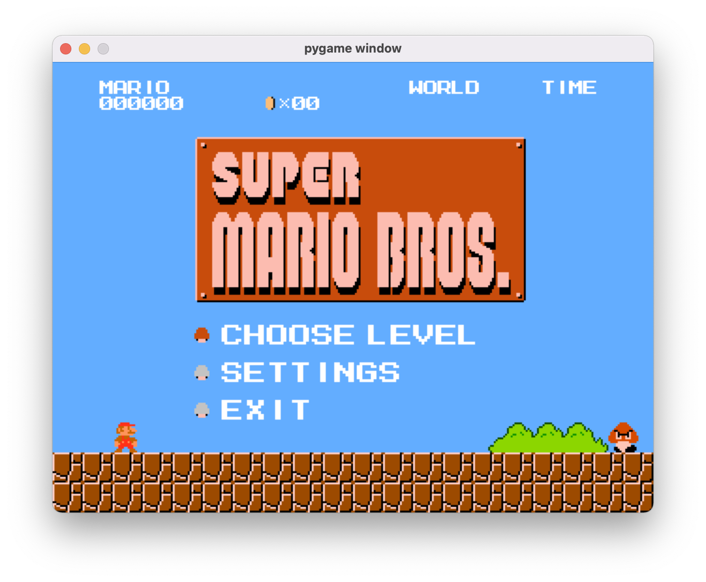

# 기존 코드 문서

기존에 작성되있던 클래스, 함수를 문서화 하여 향후 개발에 참고할 예정입니다.

## 목차

1. [classes](#classes)
   1. [classes.Menu.Menu](#classesmenumenu)
   2. [classes.Dashboard.Dashboard](#classesdashboarddashboard)

# classes

프로그램의 구동과 관련된 클래스들로 구성되어 있다.

## classes.Menu.Menu

```py
class Menu(screen=None,
	dashboard=None,
	level=None,
	sound=None)
```

### 목적

게임 시작 직후 나오는 메인 화면과 설정 화면을 담당하는 클래스.



### 파라미터

#### screen

* 형식: pygame.Surface

* 설명: 메인 화면을 그릴 공간.

#### dashboard

* 형식: [classes.Dashboard.Dashboard](#classesdashboarddashboard)

* 설명: 화면에 게임 플레이와 관련된 글자를 그리는 클래스. 여기서는 선택 메뉴의 글자 출력을 위해서 쓰임.

#### level

* 형식: [classes.Level.Level](#classeslevellevel)

* 설명: 레벨 배경 출력, 레벨 목록 생성 등 레벨에 관한 전반적인 입출력을 담당하는 클래스. 여기서는 메인화면 뒷 배경 출력, 레벨 목록 생성 및 선택, 메뉴에서의 키보드 입력 감지 를 위해 사용됨.

#### sound

* 형식: [classes.Sound.Sound](#classessoundsound)

* 설명: 게임 소리 출력을 담당하는 클래스. 여기서는 배경음과 사운드 설정을 위해서 사용됨.

## classes.Dashboard.Dashboard

